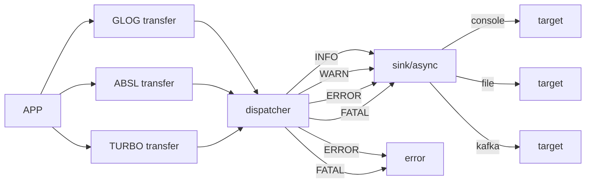

<!--
  Auto-generated by kmpkg tools
  --------------------------------
  This section/template was generated by kmpkg for reference.
  You may modify it freely to suit your project needs.
  Recommended to keep the structure for consistency across projects.
  version: 0.7.0
  date: 2026-03-18
-->

heaton
=============================

[中文版](./README_CN.md)

Heaton is a high-performance, non-intrusive logging management switch built for modern C++. It features a **four-layer decoupled architecture**:
**Upstream (Collection) → Dispatch (Routing) → Sink (Buffering) → Target (Persistence)**.
It unifies log streams from GLog, Abseil, and Turbo, while providing industrial-grade automated operations capabilities.

## 🚀 Core Value

- **Unified Upstream**
  Using upstream interception technology, Heaton transparently takes over log output from GLog, Abseil, and Turbo, normalizing fragmented logs into a unified time-series stream.

- **Extreme Performance (Zero-copy Dispatch)**
  Achieves zero-copy forwarding on the synchronous path. On the asynchronous path, it uses swap buffers and state-machine signal suppression to minimize syscall overhead.

- **Industrial-Grade Self-Healing Target**
  Built-in Daily/Hourly/Rotating rotation policies, with support for automatic directory creation, disk-full backoff and retry, and automatic cleanup of historical logs.

- **Non-Intrusive Integration**
  No changes to existing business code using `LOG(INFO)` are required. A single initialization line in `main()` enables global log governance.



## Features

| Feature | Implementation Details |
|---------|------------------------|
| Async Pump | Based on `std::deque` + pointer swapping; lock contention remains constant at nanosecond scale. |
| Signal Suppression | State machine identifies `kWorking` state and automatically suppresses invalid `condition_variable` notifications. |
| Memory Control | Strictly follows rvalue reference move semantics to ensure zero secondary copies during asynchronous dispatch. |
| Ops Closed-Loop | Scans existing disk files on restart and reconstructs a `circular_queue` to manage lifecycle. |
| Error Governance | Uses `turbo::Status` return codes throughout; no exceptions, with strong binary compatibility. |

## 🛠️ Build
This project uses [kmpkg](https://github.com/kumose/kmcmake) for dependency management and build integration.
kmpkg automates third-party library downloading, dependency resolution, and compiler flag configuration, eliminating the need for manual maintenance of complex CMake setups.

### 0. Prerequisites

- Linux (Ubuntu 20.04+ / CentOS 7+ recommended)
- CMake ≥ 3.25
- GCC ≥ 9.4 / Clang ≥ 12
- `kmpkg` installed
  (See [installation docs](https://kumo-pub.github.io/docs/category/%E6%8C%81%E7%BB%AD%E9%9B%86%E6%88%90----kmpkg))

### 1. Configure Project (Optional)

- Full dependencies are listed in [`kmpkg.json`](kmpkg.json)
- To update the dependency baseline, edit [`kmpkg-configuration.json`](kmpkg-configuration.json)
  and modify the `baseline` field under `default-registry`
- The `baseline` can be set to the latest commit via `git log`
- Optional: Users may manage dependencies manually, as long as CMake `find_package` locates them correctly
    - Example: Install dependencies to system or custom paths, then specify via `CMAKE_PREFIX_PATH`
    - Or declare external dependency paths in kmpkg to avoid redundant downloads

### 2. Build Project

From the project root:

```bash
cmake --preset=default
cmake --build build -j$(nproc)
```

Self-managed dependencies:

```shell
mkdir build
cd build
cmake ..
make -j$(nproc)
```

***Note***
`--preset=default` requires a corresponding CMake Preset defined in the project root.

### 3. Run Tests (Optional)

From the project root:

```shell
ctest --test-dir build
```

## Example

```c++
#include <heaton/heaton.h>
#include <heaton/glog.h>
#include <turbo/log/logging.h>

int main(int argc, char **argv) {
    heaton::HeatonOption option(argv[0]);
    option.upstream.enable_absl = true;
    option.upstream.enable_turbo = true;
    option.upstream.enable_glog = true;
    option.create_if_missing = true;
    option.global.type = heaton::SinkType::SINK_ASYNC_FILE;
    option.global.target.target_type = heaton::TargetType::TARGET_DAILY;
    option.global.target.filename = "logs/tlog.txt";
    auto rs = heaton::Heaton::get_instance()->initialize(option);
    std::cerr << rs.to_string() << std::endl;
    if (!rs.ok()) {
        return 1;
    }
    ABSL_LOG(INFO) << "absl log";
    KLOG(INFO) << "turbo log";
    LOG(INFO) << "glog log";
    return 0;
}
```
