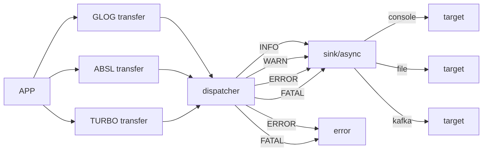

<!--
  Auto-generated by kmpkg tools
  --------------------------------
  This section/template was generated by kmpkg for reference.
  You may modify it freely to suit your project needs.
  Recommended to keep the structure for consistency across projects.
  version: 0.7.0
  date: 2026-03-18
-->

heaton
=============================

[English](./README.md)

Heaton 是一个为现代 C++ 构建的高性能、非侵入式日志管理交换机。它通过 Upstream (采集) -> Dispatch (路由) -> Sink (缓冲) -> Target (落盘) 的四层解耦架构，强行统一了 GLog、Abseil 和 Turbo 的日志流，并提供工业级的自动运维能力。
🚀 核心价值

* 多源合一 (Unified Upstream)：通过 Upstream 拦截技术，无感接管 GLog、Abseil 和 Turbo 的日志输出，将碎片化的日志归一化为统一的时序流。
* 极致性能 (Zero-copy Dispatch)：在同步路径下实现零拷贝转发；在异步路径下利用 Swap 缓冲区 和 状态机信号抑制 技术，将系统调用（Syscall）开销压低至极致。
* 工业级自愈 (Self-healing Target)：内置 Daily/Hourly/Rotating 轮转策略，支持目录自动创建、磁盘满退避重试以及历史日志自动清理。
* 非侵入式接入：无需修改已有业务代码中的 LOG(INFO)，只需在 main 函数一行初始化，即可接管全局日志治理。



### 特点

| 特性 | 实现细节 |
|---|---|
| 异步泵 | 基于 std::deque + swap 指针交换，锁竞争耗时恒定在纳秒级。 |
| 信号抑制 | 状态机识别 kWorking 状态，自动屏蔽无效的 condition_variable 通知。 |
| 内存控制 | 严格遵循右值引用移动语义，确保异步分发过程中零二次拷贝。 |
| 运维闭环 | 重启时自动扫描磁盘存量文件，重建 circular_queue 管理生命周期。 |
| 错误治理 | 全流程采用 turbo::Status 返回值，拒绝异常，二进制兼容性极强。 |


## 🛠️ Build

本项目使用 [kmpkg](https://github.com/kumose/kmcmake) 进行依赖管理与构建集成。
kmpkg 会自动处理第三方库下载、依赖查找、编译标志配置等，避免手工维护复杂的 CMake 配置。

### 0. 准备环境

- Linux (Ubuntu 20.04+ / CentOS 7+ 推荐)
- CMake >= 3.25
- GCC >= 9.4 / Clang >= 12
- 已安装 `kmpkg`
  （参见 [安装文档](https://kumo-pub.github.io/docs/category/%E6%8C%81%E7%BB%AD%E9%9B%86%E6%88%90----kmpkg)）

### 1. 配置项目(可选)

- 完整的依赖请参见[`kmpkg.json`](kmpkg.json)
- 更新依赖基线请参见[`kmpkg-configuration.json`](kmpkg-configuration.json) 修改
  `default-registry`的`baseline`
- `baseline` 可通过 `git log` 获取最新提交
- 可选：用户可以自行管理依赖，确保 CMake 的 find_package 能正确找到所需库

    - 例如在系统路径或自定义路径安装依赖，并通过 CMAKE_PREFIX_PATH 指定
    - 或在 kmpkg 中声明外部依赖路径，避免重复下载

### 2. 编译项目

在项目根目录执行：

```bash
cmake --preset=defualt
cmake --build build -j$(nproc)
```

自管理依赖：

```shell
mkdir build
cd build
cmake ..
make -j$(nproc)
```

***注意***

    --preset=default 需确保已在项目根目录下定义相应 CMake Preset

### 3. 运行测试(可选)

在项目根目录执行：

```shell
ctest --test-dir build
```

## 例子

```c++
#include <heaton/heaton.h>
#include <heaton/glog.h>
#include <turbo/log/logging.h>

int main(int argc, char **argv) {
    heaton::HeatonOption option(argv[0]);
    option.upstream.enable_absl = true;
    option.upstream.enable_turbo = true;
    option.upstream.enable_glog = true;
    option.create_if_missing = true;
    option.global.type = heaton::SinkType::SINK_ASYNC_FILE;
    option.global.target.target_type = heaton::TargetType::TARGET_DAILY;
    option.global.target.filename = "logs/tlog.txt";
    auto rs = heaton::Heaton::get_instance()->initialize(option);
    std::cerr<<rs.to_string()<<std::endl;
    if (!rs.ok()) {
        return 1;
    }
    ABSL_LOG(INFO)<<"absl log";
    KLOG(INFO)<<"turbo log";
    LOG(INFO)<<"glog log";
    return 0;
}
```